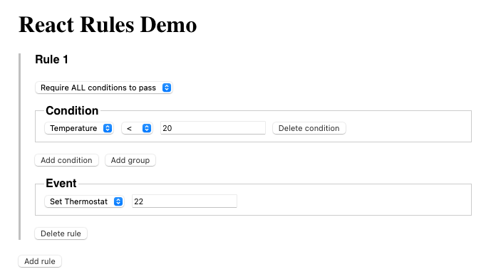

# React Rules

A flexible React component for building and managing business rules with [json-rules-engine](https://github.com/CacheControl/json-rules-engine/tree/master).



## Installation

```bash
npm install react-rules
```

## Usage

Here's a basic example of how to use the `RuleEditor` component:

```tsx
import React from 'react';
import { RuleEditor } from 'react-rules';

export const facts = [
  { value: 'temperature', label: 'Temperature' },
  { value: 'humidity', label: 'Humidity' },
];

export const operators = [
  { value: 'equal', label: '==' },
  { value: 'notEqual', label: '!=' },
  { value: 'lessThan', label: '<' },
  { value: 'lessThanInclusive', label: '<=' },
  { value: 'greaterThan', label: '>' },
  { value: 'greaterThanInclusive', label: '>=' },
];

export const events = [
  { value: 'set_thermostat', label: 'Set Thermostat' },
  { value: 'set_fan', label: 'Set Fan' },
];

const rules = [
  {
    "conditions": {
      "all": [
        {
          "fact": "temperature",
          "operator": "lessThan",
          "value": 20
        }
      ]
    },
    "event": {
      "type": "set_thermostat",
      "params": {
        "value": 22
      }
    }
  }
]

const App: React.FC = () => (
    <RuleEditor
      value={JSON.stringify(rules)}
      onChange={console.log}
      facts={facts}
      operators={operators}
      events={events}
    />
);

export default App;
```

## Customization

You can customize the styles by passing a `styles` object to the `RuleEditor` component. The default styles can be imported and extended:

```tsx
import { RuleEditor, defaultStyles } from 'react-rules';

const customStyles = {
  ...defaultStyles,
  container: {
    ...defaultStyles.container,
    border: '1px solid blue',
    padding: '20px',
  },
};

<RuleEditor styles={customStyles} {...otherProps} />
```


## Demo

To run the demo locally, clone the repository and run the following commands:

```bash
npm install
npm run dev
```

This will start a local development server. You can view the demo at `http://localhost:3000`.

## CI/CD Pipeline

This project uses GitHub Actions for continuous integration and deployment:

- **Pull Request Checks**: Every PR runs automated tests to ensure code quality
- **Automated Releases**: Merging to `main` triggers automatic versioning and publishing
- **Semantic Versioning**: Version numbers are automatically determined based on commit messages
